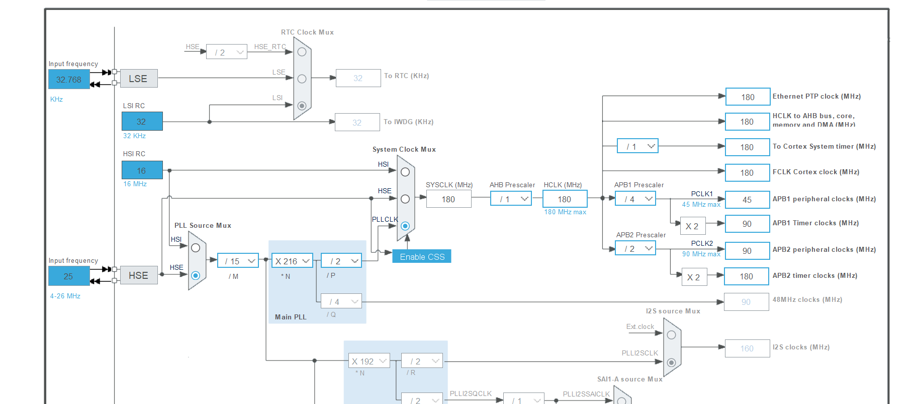

# About STM32F429IGT6

## 1. Decoupling Capacitor Array 去耦电容阵列

这是一个去耦电容阵列的电路图，主要用于电源的去耦和滤波。

### 电路功能：
每个电容（如 C7 到 C14 和 C15 到 C21）都并联在 3.3V 电源和地之间。
这些电容的容量为 0.1µF，通常用于滤除高频噪声。
电容采用 C0402 尺寸封装，体积小，适合密集的电路板设计。
为什么使用多个电容：
均匀分布：
去耦电容应该尽量靠近 IC 的电源引脚放置，多个电容可以减少电源线上可能存在的电压波动。
### 滤波效果增强：
并联多个电容可以提高滤除高频噪声的能力，因为并联电容的等效电感会减小，有利于高频性能的改善。
减少阻抗：
在不同位置分布电容阵列，能够降低系统中电源阻抗的共振点。
### 常见应用场景：
高性能数字电路：如 FPGA、MCU 或高速处理器的电源去耦。
射频模块：对电源质量要求高的通信电路。
电源电路设计：减少电压波动和噪声。
如果是 STM32F429 或其他微控制器的应用，这种设计可能用于为核心供电（3.3V VDD），以稳定电源和改善 EMC 性能。
---
## 2. HSE
HSE HSI 查看原理图

在 STM32 的时钟系统中，HSE（高速外部时钟）经过 PLL（Phase-Locked Loop，锁相环）模块的倍频和分频后，可以生成系统所需的高频时钟。下面是这个过程中如何从 25 MHz HSE 生成 180 MHz SYSCLK 的解析：

---

### 时钟生成步骤：

1. **输入时钟选择：**
   - HSE 外部时钟的输入频率是 25 MHz。
   - 通过 **PLL Source Mux**，选择 HSE 作为 PLL 的输入源。

2. **分频器 (M 分频)：**
   - HSE 时钟首先通过一个预分频器 $M$，分频的作用是将 HSE 时钟降低到 PLL 可接受的输入范围（一般为 1~2 MHz）。
   - 在这个例子中，$M = 15$，因此：
     $
     f_{PLL\_IN} = \frac{f_{HSE}}{M} = \frac{25}{15} \approx 1.6667 \, \text{MHz}
     $

3. **倍频器 (N 倍频)：**
   - 分频后的时钟 $f_{PLL\_IN}$ 被倍频器 $N$ 放大。
   - 倍频因子 $N = 216$，因此：
     $
     f_{PLL\_VCO} = f_{PLL\_IN} \times N = 1.6667 \times 216 = 360 \, \text{MHz}
     $

4. **主分频器 (P 分频)：**
   - $f_{PLL\_VCO}$ 输出的 360 MHz 时钟通过 $P$ 分频器生成系统时钟 $SYSCLK$。
   - 在这个例子中，$P = 2$，因此：
     $
     f_{SYSCLK} = \frac{f_{PLL\_VCO}}{P} = \frac{360}{2} = 180 \, \text{MHz}
     $

5. **最终时钟输出：**
   - 经由时钟复用器，SYSCLK 最终输出到 AHB、APB 和其他外设时钟域。

从 25 MHz 的 HSE 输入时钟到 180 MHz 的系统时钟，主要依赖以下参数：
- **预分频器 M**：控制输入频率范围。
- **倍频器 N**：提高频率到目标范围。
- **主分频器 P**：将高频率降低到最终系统时钟。

因此，25 MHz HSE 可以通过配置 M=15, N=216, P=2，在主 PLL 中生成 180 MHz 的系统时钟。