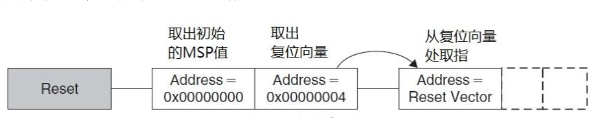

# STM32F4XX 启动过程
## startup_stm32f429xx.s
### 1. 栈配置
```armasm
Stack_Size		EQU     0x400

                AREA    STACK, NOINIT, READWRITE, ALIGN=3
Stack_Mem       SPACE   Stack_Size
__initial_sp
```
作用：为系统分配堆栈空间，并导出栈顶指针 __initial_sp。

段属性：

NOINIT：不初始化此段内容。

READWRITE：可读可写。

ALIGN=3：按 8 字节对齐（2^3 = 8）。

物理地址：链接时，STACK 段会被放置在 RAM 的起始地址（如 0x20000000）。

### 2. 堆配置
```armasm
Heap_Size      EQU     0x200

                AREA    HEAP, NOINIT, READWRITE, ALIGN=3
__heap_base
Heap_Mem        SPACE   Heap_Size
__heap_limit
```
作用：为动态内存分配（如 malloc）预留堆空间。

段属性：与 STACK 段相同，但独立于堆栈。

### 3. 定义中断向量表
上文为堆栈分配的空间均位于SRAM中，不占用代码空间.

从这个数据段开始才是stm32代码空间的起始位置，先定义并初始化了栈顶位置（__initial_sp）以及15个内核异常处理函数的入口地址，接下来是外部中断，最后用结束地址减去开始地址得到__Vectors_Size即本数据段的大小
```armasm
; Vector Table Mapped to Address 0 at Reset
; RESET（向量表）被链接到 Flash 起始地址（如 0x08000000）
                AREA    RESET, DATA, READONLY
                EXPORT  __Vectors
                EXPORT  __Vectors_End
                EXPORT  __Vectors_Size

__Vectors       DCD     __initial_sp               ; Top of Stack
                DCD     Reset_Handler              ; Reset Handler
                DCD     NMI_Handler                ; NMI Handler
                DCD     HardFault_Handler          ; Hard Fault Handler
                DCD     MemManage_Handler          ; MPU Fault Handler
                DCD     BusFault_Handler           ; Bus Fault Handler
                DCD     UsageFault_Handler         ; Usage Fault Handler
                DCD     0                          ; Reserved
                DCD     0                          ; Reserved
                DCD     0                          ; Reserved
                DCD     0                          ; Reserved
                DCD     SVC_Handler                ; SVCall Handler
                DCD     DebugMon_Handler           ; Debug Monitor Handler
                DCD     0                          ; Reserved
                DCD     PendSV_Handler             ; PendSV Handler
                DCD     SysTick_Handler            ; SysTick Handler

                ; External Interrupts
                DCD     WWDG_IRQHandler                   ; Window WatchDog                                        
                DCD     PVD_IRQHandler                    ; PVD through EXTI Line detection                        
                DCD     TAMP_STAMP_IRQHandler             ; Tamper and TimeStamps through the EXTI line            
                DCD     RTC_WKUP_IRQHandler               ; RTC Wakeup through the EXTI line                       
                DCD     FLASH_IRQHandler                  ; FLASH                                           
                DCD     RCC_IRQHandler                    ; RCC                                             
                DCD     EXTI0_IRQHandler                  ; EXTI Line0                                             
                DCD     EXTI1_IRQHandler                  ; EXTI Line1                                             
                DCD     EXTI2_IRQHandler                  ; EXTI Line2                                             
                DCD     EXTI3_IRQHandler                  ; EXTI Line3                                             
                DCD     EXTI4_IRQHandler                  ; EXTI Line4                                             
                DCD     DMA1_Stream0_IRQHandler           ; DMA1 Stream 0                                   
                DCD     DMA1_Stream1_IRQHandler           ; DMA1 Stream 1                                   
                DCD     DMA1_Stream2_IRQHandler           ; DMA1 Stream 2                                   
                DCD     DMA1_Stream3_IRQHandler           ; DMA1 Stream 3                                   
                DCD     DMA1_Stream4_IRQHandler           ; DMA1 Stream 4                                   
                DCD     DMA1_Stream5_IRQHandler           ; DMA1 Stream 5                                   
                DCD     DMA1_Stream6_IRQHandler           ; DMA1 Stream 6                                   
                DCD     ADC_IRQHandler                    ; ADC1, ADC2 and ADC3s                            
                DCD     CAN1_TX_IRQHandler                ; CAN1 TX                                                
                DCD     CAN1_RX0_IRQHandler               ; CAN1 RX0                                               
                DCD     CAN1_RX1_IRQHandler               ; CAN1 RX1                                               
                DCD     CAN1_SCE_IRQHandler               ; CAN1 SCE                                               
                DCD     EXTI9_5_IRQHandler                ; External Line[9:5]s                                    
                DCD     TIM1_BRK_TIM9_IRQHandler          ; TIM1 Break and TIM9                   
                DCD     TIM1_UP_TIM10_IRQHandler          ; TIM1 Update and TIM10                 
                DCD     TIM1_TRG_COM_TIM11_IRQHandler     ; TIM1 Trigger and Commutation and TIM11
                DCD     TIM1_CC_IRQHandler                ; TIM1 Capture Compare                                   
                DCD     TIM2_IRQHandler                   ; TIM2                                            
                DCD     TIM3_IRQHandler                   ; TIM3                                            
                DCD     TIM4_IRQHandler                   ; TIM4                                            
                DCD     I2C1_EV_IRQHandler                ; I2C1 Event                                             
                DCD     I2C1_ER_IRQHandler                ; I2C1 Error                                             
                DCD     I2C2_EV_IRQHandler                ; I2C2 Event                                             
                DCD     I2C2_ER_IRQHandler                ; I2C2 Error                                               
                DCD     SPI1_IRQHandler                   ; SPI1                                            
                DCD     SPI2_IRQHandler                   ; SPI2                                            
                DCD     USART1_IRQHandler                 ; USART1                                          
                DCD     USART2_IRQHandler                 ; USART2                                          
                DCD     USART3_IRQHandler                 ; USART3                                          
                DCD     EXTI15_10_IRQHandler              ; External Line[15:10]s                                  
                DCD     RTC_Alarm_IRQHandler              ; RTC Alarm (A and B) through EXTI Line                  
                DCD     OTG_FS_WKUP_IRQHandler            ; USB OTG FS Wakeup through EXTI line                        
                DCD     TIM8_BRK_TIM12_IRQHandler         ; TIM8 Break and TIM12                  
                DCD     TIM8_UP_TIM13_IRQHandler          ; TIM8 Update and TIM13                 
                DCD     TIM8_TRG_COM_TIM14_IRQHandler     ; TIM8 Trigger and Commutation and TIM14
                DCD     TIM8_CC_IRQHandler                ; TIM8 Capture Compare                                   
                DCD     DMA1_Stream7_IRQHandler           ; DMA1 Stream7                                           
                DCD     FMC_IRQHandler                    ; FMC                                             
                DCD     SDIO_IRQHandler                   ; SDIO                                            
                DCD     TIM5_IRQHandler                   ; TIM5                                            
                DCD     SPI3_IRQHandler                   ; SPI3                                            
                DCD     UART4_IRQHandler                  ; UART4                                           
                DCD     UART5_IRQHandler                  ; UART5                                           
                DCD     TIM6_DAC_IRQHandler               ; TIM6 and DAC1&2 underrun errors                   
                DCD     TIM7_IRQHandler                   ; TIM7                   
                DCD     DMA2_Stream0_IRQHandler           ; DMA2 Stream 0                                   
                DCD     DMA2_Stream1_IRQHandler           ; DMA2 Stream 1                                   
                DCD     DMA2_Stream2_IRQHandler           ; DMA2 Stream 2                                   
                DCD     DMA2_Stream3_IRQHandler           ; DMA2 Stream 3                                   
                DCD     DMA2_Stream4_IRQHandler           ; DMA2 Stream 4                                   
                DCD     ETH_IRQHandler                    ; Ethernet                                        
                DCD     ETH_WKUP_IRQHandler               ; Ethernet Wakeup through EXTI line                      
                DCD     CAN2_TX_IRQHandler                ; CAN2 TX                                                
                DCD     CAN2_RX0_IRQHandler               ; CAN2 RX0                                               
                DCD     CAN2_RX1_IRQHandler               ; CAN2 RX1                                               
                DCD     CAN2_SCE_IRQHandler               ; CAN2 SCE                                               
                DCD     OTG_FS_IRQHandler                 ; USB OTG FS                                      
                DCD     DMA2_Stream5_IRQHandler           ; DMA2 Stream 5                                   
                DCD     DMA2_Stream6_IRQHandler           ; DMA2 Stream 6                                   
                DCD     DMA2_Stream7_IRQHandler           ; DMA2 Stream 7                                   
                DCD     USART6_IRQHandler                 ; USART6                                           
                DCD     I2C3_EV_IRQHandler                ; I2C3 event                                             
                DCD     I2C3_ER_IRQHandler                ; I2C3 error                                             
                DCD     OTG_HS_EP1_OUT_IRQHandler         ; USB OTG HS End Point 1 Out                      
                DCD     OTG_HS_EP1_IN_IRQHandler          ; USB OTG HS End Point 1 In                       
                DCD     OTG_HS_WKUP_IRQHandler            ; USB OTG HS Wakeup through EXTI                         
                DCD     OTG_HS_IRQHandler                 ; USB OTG HS                                      
                DCD     DCMI_IRQHandler                   ; DCMI  
                DCD     0                          ; Reserved				                              
                DCD     HASH_RNG_IRQHandler               ; Hash and Rng
                DCD     FPU_IRQHandler                    ; FPU
                DCD     UART7_IRQHandler                  ; UART7
                DCD     UART8_IRQHandler                  ; UART8
                DCD     SPI4_IRQHandler                   ; SPI4
                DCD     SPI5_IRQHandler                   ; SPI5
                DCD     SPI6_IRQHandler                   ; SPI6
                DCD     SAI1_IRQHandler                   ; SAI1
                DCD     LTDC_IRQHandler                   ; LTDC
                DCD     LTDC_ER_IRQHandler                ; LTDC error
                DCD     DMA2D_IRQHandler                  ; DMA2D
                                         
__Vectors_End

__Vectors_Size  EQU  __Vectors_End - __Vectors
```
作用：定义中断向量表，包含初始栈顶指针和中断服务程序入口地址。

段属性：

DATA：包含数据（地址指针）。

READONLY：运行时不可修改。

物理地址：链接时，RESET 段会被放置在 Flash 的起始地址（如 0x08000000）
#### Q1：为什么向量表定义在堆栈“下方”，但物理地址不冲突？
代码顺序 ≠ 内存布局
代码中的 STACK 和 RESET 段只是逻辑定义，它们的物理地址由链接脚本（如 .ld 文件）决定：

RESET（向量表）被链接到 Flash 起始地址（如 0x08000000）。

STACK 和 HEAP 被链接到 RAM 起始地址（如 0x20000000）。

两者位于不同的存储器区域，物理地址无重叠。
#### Q2：__Vectors 的第一个条目为何是 __initial_sp？
Cortex-M 内核的启动要求

向量表的第一个条目是 初始栈顶指针（__initial_sp），第二个条目是 复位处理函数（Reset_Handler）。

复位时，Cortex-M 内核会从 Flash 起始地址（0x08000000）自动读取这两个值：

将 __initial_sp 加载到 SP 寄存器（初始化堆栈）。

将 Reset_Handler 加载到 PC 寄存器（开始执行程序）。

#### 复位程序Reset_Handler
reset_handler即复位程序的实际执行代码，上电或是复位都会先从这里开始执行然后进入main函数
```armasm
; Reset handler
Reset_Handler    PROC
                 EXPORT  Reset_Handler             [WEAK]
        IMPORT  SystemInit
        IMPORT  __main

                 LDR     R0, =SystemInit
                 BLX     R0
                 LDR     R0, =__main
                 BX      R0
                 ENDP
```
定义了一个服务程序，PROC表示程序的开始

使用EXPORT将Reset_Handler声明为可被外部引用。WEAK表示弱定义

SystemInit()是一个库函数，定义在system_stm32f4xx.c中

__main是标准的C库函数，是编译时隐含的宏，指向main.c中的main()函数，是用户代码的开始

`LDR    R0, =SystemInit`将SystemInit()的地址加载到R0寄存器

`BLX`跳转到R0指向的地址，并根据寄存器的LSE确定处理器的状态，同时把跳转前的下一条指令保存到LR寄存器

`LR`跳转到指定地址后并不返回，和`LDR`有区别，LDR会返回

注意到之后的其他中断处理程序中`B    .`，`B`表示跳转，跳转到`.`表示无限循环

### 堆栈初始化开启
堆栈初始化是由一个if条件来实现的，MICROLIB宏的定义与否决定了堆栈的初始化方式

在Keil 中的Option->Target中设置勾选，或在编译选项中定义__MICROLIB宏

如果没有定义这个宏，则会使用双段存储器模式，且声明了的__user_initial__stackheap具有全局属性

标准C库会接受这个自定义堆栈的函数的四个参数地址

在startup_stm32f429xx.s结尾有
```armasm
; User Stack and Heap initialization
                 IF      :DEF:__MICROLIB
                
                 EXPORT  __initial_sp
                 EXPORT  __heap_base
                 EXPORT  __heap_limit
                
                 ELSE
                
                 IMPORT  __use_two_region_memory
                 EXPORT  __user_initial_stackheap
                 
__user_initial_stackheap

                 LDR     R0, =  Heap_Mem
                 LDR     R1, =(Stack_Mem + Stack_Size)
                 LDR     R2, = (Heap_Mem +  Heap_Size)
                 LDR     R3, = Stack_Mem
                 BX      LR

                 ALIGN

                 ENDIF

                 END
```

## 关于MICROLIB

在 Keil MDK 开发环境中，**USE MICROLIB** 是一个与 C 标准库相关的编译选项。它的勾选与否会直接影响嵌入式系统的代码体积、内存占用以及部分功能的可用性。以下是详细对比和分析：

---

### **一、MicroLIB 的本质**
**MicroLIB** 是 Keil 提供的一个**高度优化的简化版 C 标准库**，专为资源受限的嵌入式系统设计。与完整版的标准库（如 ARM 的 `ARMCLIB`）相比，它有以下核心特点：

| **特性**            | **MicroLIB**                              | **完整标准库**                          |
|---------------------|-------------------------------------------|----------------------------------------|
| **代码体积**         | **极小**（通常减少 50%~80%）              | 较大                                   |
| **内存占用**         | 更低（堆/栈需求更小）                     | 较高                                   |
| **功能完整性**       | **阉割版**（移除部分非关键功能）          | 完整支持 C89/C99 标准库                |
| **系统依赖**         | 不依赖操作系统（适合裸机）                | 依赖操作系统接口（如 `_sys_*` 函数）   |
| **启动代码**         | 需要特殊初始化（如 `__initial_sp` 手动配置）| 自动初始化复杂运行时环境               |
| **浮点支持**         | 默认不支持（需手动添加浮点运算库）        | 支持浮点运算                           |

---

### **二、关键区别详解**

#### 1. **代码体积与内存优化**
- **MicroLIB 优势**：  
  - 移除未使用的库函数（如文件 I/O、宽字符支持、区域设置等）。  
  - 采用静态链接策略，仅包含实际调用的函数。  
  - **典型场景**：在 STM32F4 等 Flash 较小的芯片中，使用 MicroLIB 可将代码体积从 20KB 压缩到 5KB。

- **完整标准库劣势**：  
  - 包含大量未使用的函数，导致代码膨胀。  
  - 动态内存管理（如 `malloc`）开销更大。

#### 2. **系统调用与依赖**
- **MicroLIB 的裸机友好性**：  
  - **无需操作系统支持**：直接操作硬件（如通过重定向 `printf` 到串口，无需实现 `_sys_write`）。  
  - **简化启动代码**：无需初始化复杂的运行时环境（如 `__main` 中的库初始化流程）。  

- **完整标准库的依赖**：  
  - 需要实现 `_sys_*` 系统调用函数（如 `_sys_open`, `_sys_read`），否则链接失败。  
  - 依赖半主机（Semihosting）机制（需调试器支持），不适合独立运行。

#### 3. **功能限制**
- **MicroLIB 不支持的功能**：  
  - 文件操作（`fopen`, `fread` 等）。  
  - 宽字符（`wchar_t`）和多字节字符集。  
  - 动态内存分配（`malloc`）的健壮性较差（需自定义堆管理）。  
  - 浮点格式化输出（如 `printf("%f")` 需额外代码）。

- **完整标准库的完整性**：  
  - 支持完整的 C 标准库功能。  
  - 提供更可靠的动态内存管理。

#### 4. **启动流程差异**
- **MicroLIB 的启动代码**：  
  ```c
  // 启动文件需显式初始化堆栈指针
  __initial_sp = 0x20005000;  // 手动指定栈顶地址
  ```
  - 无需执行 `__main` 中的库初始化代码，直接跳转到 `main()`。

- **完整标准库的启动流程**：  
  ```c
  Reset_Handler:
      BL      __main          // 初始化库和运行时环境
      BL      main            // 进入用户 main 函数
  ```
  - `__main` 会初始化 C 库、复制初始化数据段（RW Data）、清零未初始化数据段（BSS）等。

---

### **三、何时使用 MicroLIB？**

#### **推荐使用场景**：
1. **资源极度受限**：Flash/RAM 容量紧张（如 STM32F0/F1 系列）。  
2. **裸机开发**：无操作系统，且不需要复杂文件操作。  
3. **调试需求简单**：直接通过串口输出调试信息（重定向 `printf`）。  
4. **对代码体积敏感**：需最小化固件体积（如 Bootloader）。

#### **避免使用场景**：
1. **需要完整 C 标准库功能**：如文件操作、区域设置等。  
2. **动态内存频繁分配**：MicroLIB 的 `malloc` 实现较为脆弱。  
3. **浮点运算依赖库函数**：需自行实现浮点支持。  
4. **使用 RTOS**：某些 RTOS 依赖完整标准库的线程安全机制。

---

### **四、常见问题与解决方法**

#### **1. `printf` 无法输出到串口**（MicroLIB 下）：
- **重定向代码示例**：
  ```c
  #include <stdio.h>
  
  // 重定向 putchar 到串口发送
  int fputc(int ch, FILE *f) {
      USART_SendData(USART1, (uint8_t)ch);
      while (USART_GetFlagStatus(USART1, USART_FLAG_TXE) == RESET);
      return ch;
  }
  ```

#### **2. 链接错误（未定义 `_sys_exit`）**（完整标准库下）：
- **解决方法**：  
  实现空函数避免链接错误：
  ```c
  void _sys_exit(int x) {
      while(1);  // 死循环
  }
  ```

#### **3. 动态内存分配失败**（MicroLIB 下）：
- **自定义堆管理**：
  ```c
  extern char __heap_base;   // 来自启动文件的堆起始符号
  extern char __heap_limit;  // 堆结束符号
  
  void *malloc(size_t size) {
      // 手动管理堆空间
  }
  ```

---

### **五、总结**
| **决策因素**         | **选择 MicroLIB**                      | **选择完整标准库**                |
|----------------------|----------------------------------------|----------------------------------|
| **代码体积**         | 必须最小化                            | 允许较大代码                     |
| **功能需求**         | 仅需基础功能（如 `printf` 重定向）    | 需要完整 C 库功能               |
| **硬件资源**         | Flash/RAM 紧张                        | 资源充足                        |
| **开发复杂度**       | 愿意手动实现部分功能                  | 希望“开箱即用”                 |

根据项目需求权衡利弊：**优先使用 MicroLIB 优化资源占用，仅在功能必要且资源允许时切换回完整标准库**。

以下是针对该汇编代码的详细解析：

---

### **代码功能概述**
- **MicroLIB**：依赖预定义的符号（`__initial_sp`, `__heap_base`, `__heap_limit`），由链接脚本直接管理堆栈。
- **标准 C 库**：需手动实现 `__user_initial_stackheap` 函数，指定堆和栈的内存区域。

---

### **代码逐行解析**

#### **1. 条件编译块**
```armasm
IF      :DEF:__MICROLIB   ; 检查是否定义了 __MICROLIB（即是否勾选 USE MICROLIB）
```
- **作用**：根据是否使用 MicroLIB 决定编译不同的代码分支。

---

#### **2. MicroLIB 分支**
```armasm
EXPORT  __initial_sp     ; 导出栈顶指针符号
EXPORT  __heap_base      ; 导出堆起始地址符号
EXPORT  __heap_limit     ; 导出堆结束地址符号
```
- **意义**：  
  - MicroLIB 需要从链接脚本中获取 **栈顶地址（`__initial_sp`）** 和 **堆的边界（`__heap_base`, `__heap_limit`）**。  
  - 这些符号的值由链接脚本中的 `STACK` 和 `HEAP` 段定义自动计算。

- **链接脚本示例**：  
  ```ld
  STACK_SIZE = 0x400;     /* 定义栈大小 */
  HEAP_SIZE  = 0x200;     /* 定义堆大小 */

  .stack : {
    . = ALIGN(8);
    _sstack = .;          /* 栈起始地址 */
    . = . + STACK_SIZE;   /* 分配栈空间 */
    _estack = .;          /* 栈结束地址（即 __initial_sp） */
  } >RAM

  .heap : {
    . = ALIGN(8);
    __heap_base = .;      /* 堆起始地址 */
    . = . + HEAP_SIZE;    /* 分配堆空间 */
    __heap_limit = .;     /* 堆结束地址 */
  } >RAM
  ```

---

#### **3. 标准 C 库分支**
```armasm
ELSE
IMPORT  __use_two_region_memory  ; 声明使用双区内存模型（堆和栈独立）
EXPORT  __user_initial_stackheap ; 导出堆栈初始化函数符号

__user_initial_stackheap         ; 函数实现
LDR     R0, =Heap_Mem           ; R0 = 堆起始地址（Heap_Mem）
LDR     R1, =(Stack_Mem + Stack_Size) ; R1 = 栈结束地址（栈底 + 栈大小，即初始栈顶）
LDR     R2, =(Heap_Mem + Heap_Size)   ; R2 = 堆结束地址
LDR     R3, =Stack_Mem          ; R3 = 栈起始地址
BX      LR                      ; 返回
ALIGN                           ; 地址对齐
ENDIF
```
- **作用**：  
  - 当使用标准 C 库时，需实现 `__user_initial_stackheap` 函数，向库提供堆和栈的地址信息。  
  - ARM 标准库要求此函数返回以下参数（通过寄存器传递）：  
    - **R0**: 堆起始地址（Heap_Mem）  
    - **R1**: 栈结束地址（栈顶指针初始值，即 `Stack_Mem + Stack_Size`）  
    - **R2**: 堆结束地址（Heap_Mem + Heap_Size）  
    - **R3**: 栈起始地址（Stack_Mem）  

- **关键寄存器解释**：  
  | 寄存器 | 含义                   | 对应符号                |
  |--------|------------------------|-------------------------|
  | R0     | 堆起始地址             | `Heap_Mem`              |
  | R1     | 栈结束地址（初始栈顶） | `Stack_Mem + Stack_Size`|
  | R2     | 堆结束地址             | `Heap_Mem + Heap_Size`  |
  | R3     | 栈起始地址             | `Stack_Mem`             |

---

### **内存布局对比**

#### **MicroLIB 内存模型（单区）**
- **堆和栈共享同一内存区域**，可能导致堆栈冲突。  
- 需确保堆和栈的总大小不超过 RAM 容量。  
- 典型链接脚本定义：  
  ```plaintext
  RAM 布局：
  +-------------------+
  | 堆 (Heap)         | --> 从 __heap_base 到 __heap_limit
  | 栈 (Stack)        | --> 从 _sstack 到 _estack（向下生长）
  +-------------------+
  ```

#### **标准库双区内存模型**
- **堆和栈为独立区域**，避免相互覆盖。  
- 更安全，适合动态内存分配频繁的场景。  
- 典型链接脚本定义：  
  ```plaintext
  RAM 布局：
  +-------------------+
  | 栈 (Stack)        | --> 从 Stack_Mem 到 Stack_Mem + Stack_Size（向下生长）
  | ...               | --> 其他数据段（.data, .bss）
  | 堆 (Heap)         | --> 从 Heap_Mem 到 Heap_Mem + Heap_Size（向上生长）
  +-------------------+
  ```

---

### **使用场景与问题排查**

#### **何时选择 MicroLIB？**
- **资源紧张**：Flash/RAM 容量有限（如 STM32F103C8T6 仅有 20KB RAM）。  
- **简单应用**：无需复杂动态内存操作或文件 I/O。  
- **快速原型开发**：通过重定向 `printf` 到串口快速调试。

#### **何时选择标准库？**
- **功能完整性**：需要文件操作、宽字符支持等。  
- **动态内存安全**：频繁使用 `malloc`/`free` 且需隔离堆栈。  
- **兼容性要求**：与第三方库或 RTOS 集成。

#### **常见问题**
1. **堆栈溢出**  
   - **现象**：程序随机崩溃或数据损坏。  
   - **解决**：增大 `Stack_Size` 或 `Heap_Size`，检查链接脚本中的 RAM 分配。

2. **`malloc` 返回 NULL**  
   - **原因**：堆空间不足或堆未正确初始化。  
   - **排查**：确认 `__heap_base` 和 `__heap_limit` 的值是否合理。

3. **标准库链接错误**  
   - **错误示例**：`undefined symbol __use_two_region_memory`  
   - **解决**：在汇编代码中保留 `IMPORT __use_two_region_memory`。

---

### **总结**
- **MicroLIB**：简化初始化流程，依赖链接脚本定义堆栈符号，适合资源受限的裸机开发。  
- **标准库**：需手动实现 `__user_initial_stackheap`，提供更灵活的内存管理，适合复杂应用。  
- **关键点**：根据项目需求选择库类型，并确保堆栈大小与链接脚本中的 RAM 分配一致。

### THUMB 
THUMB 表示后面指令兼容 THUMB 指令。现在 Cortex-M 系列的都使用 THUMB-2 指令集，THUMB-2 是 32 位的，兼容 16 位和 32 位的指令，是 THUMB 的超集

## 启动
当系统复位后，处理器首先读取向量表中的前两个字（8 个字节），第一个字存入 MSP，第二个字为复位向量，也就是程序执行的起始地址

硬件这时自动从0x0800 0000位置处读取数据赋给栈指针SP，然后自动从0x0800 0004位置处读取数据赋给PC，完成了复位操作，SP= 0x0200 4E08，PC = 0x0800 0280
